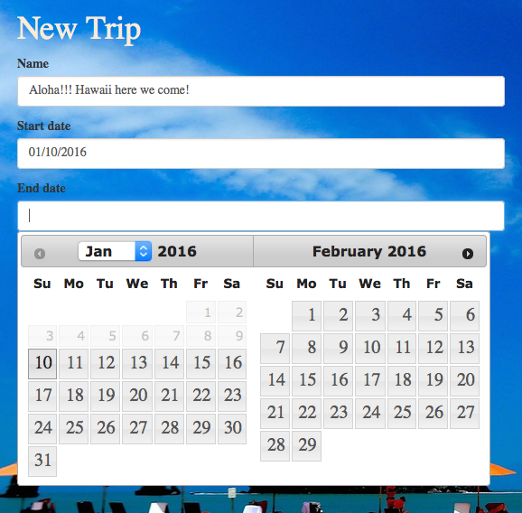
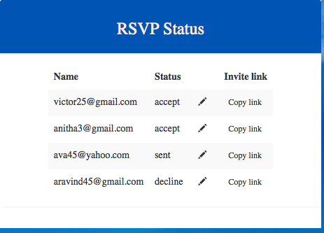
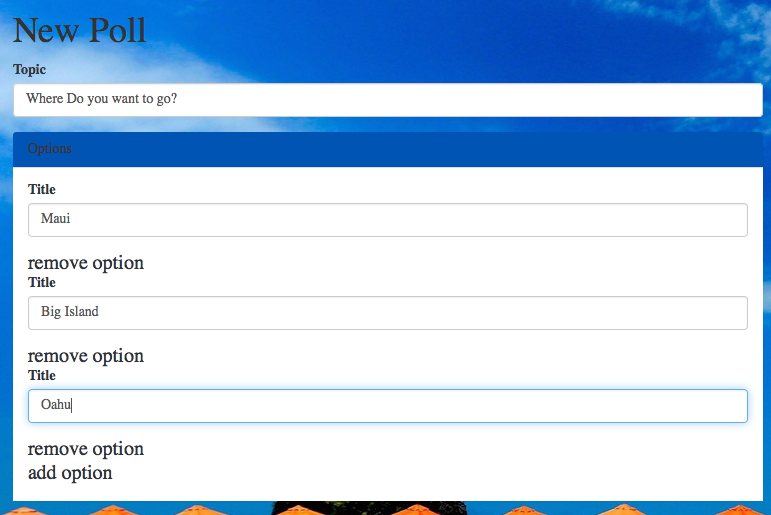
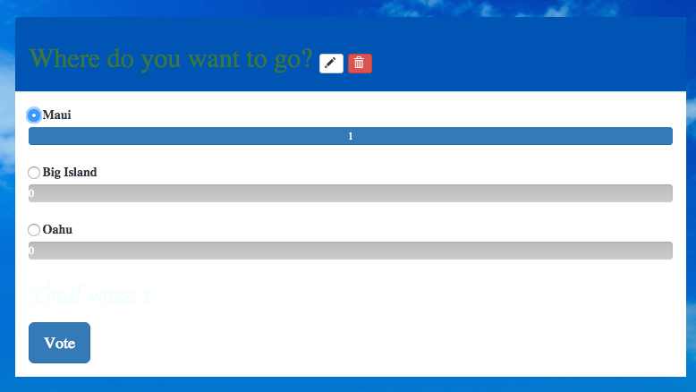
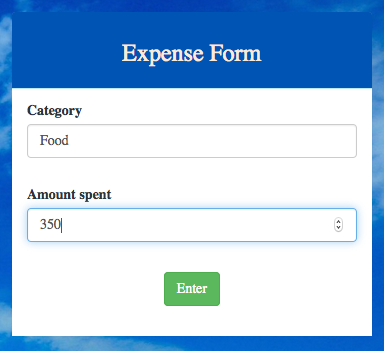
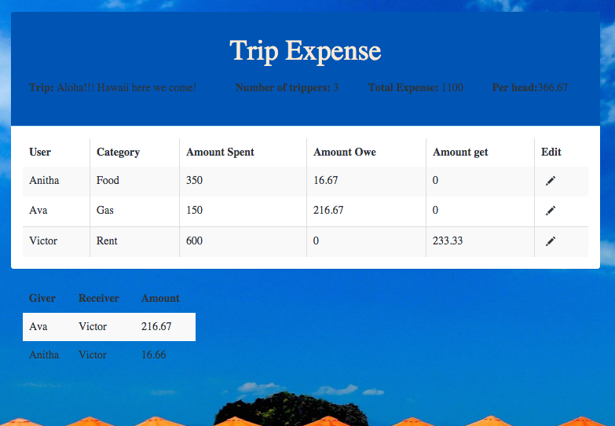

##TriPlanner

TriPlanner is a trip planning application which helps to organize trips by inviting friends and creating poll questions about where do they want to go and what they want to do in a trip. There is also a polling feature, that helps to decide based on number of votes. After a trip, it also helps in expense determination among friends. It calculates each person share based on how much they spent on the trip.

### Creating a trip
**Do you want to plan a trip with your friends to escape this cold weather?**  
We have an idea for that. TriPlanner provides a single platform to plan and manage your trip start to finish.     
Let's do it…  
**Aloha!!! Hawaii here we come!**   
With TriPlanner easy to use interface and calendaring system, it is easy to pick a name and  time range when planning  a trip.

### Invite Friends   
**No friends - No fun !!!**  
Lets invite friends to our trip to add more joy!!!   
With TriPlanner’s intuitive interface, it is  easy to invite friends in a single click. TriPlanner app sends out an email with trip details and invite.  

### RSVP Status
**Who is joining - who is not joining**

TriPlanner lets us know who is and who is not joining us in this trip and who haven't seen our invite yet by displaying status of each invite.  

### Adding Poll Questions
**Ask me!!!**  
TriPlanner helps to ask questions with multiple choices like where do they want to go and what they want to do?

### Vote  
**Let’s decide**   
TriPlanner makes decision making simpler by allowing trippers to vote for each questions asked under the trip. Based on higher number of votes, they can easily decide their plan.     

### Share Expense
**Let's keep track**     
TriPlanner lets each tripper keep track of their expenses categorically.

### Share Per Person
**No more messy calculation - We ll do for you!!!**    
TriPlanner calculates each tripper shares based on number of trippers and how much money they have spent.

